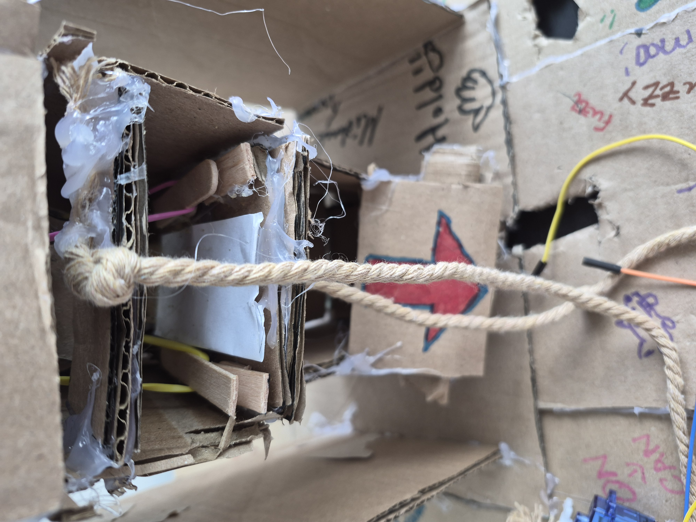
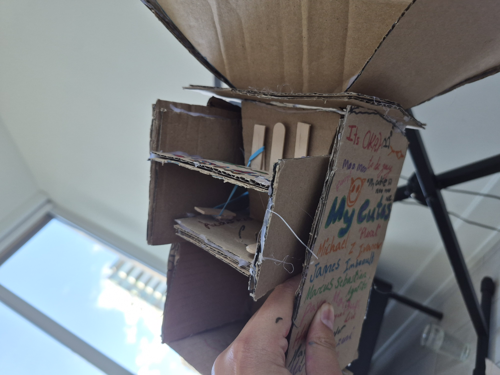
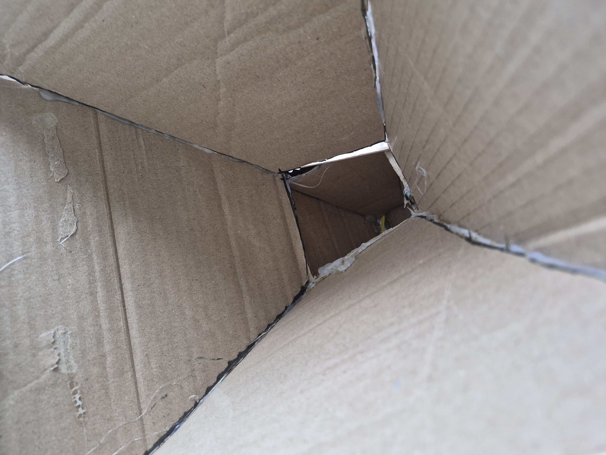

## Hazel food dispenser
This is a medium sized project for my dog, her name is Hazel.

# The dog food dispenser for Hazel.

A motion type activated dog food dispenser that was indeed built with an Arduino Uno and a servo controlled gate. Originally, I would have liked to have a PIR motion sensor when waved at, the servo horn would rotate the dispenser floor automatically. I unfortunately ran out of time for this but the project still works fundamentally nonetheless.

# How it works

An Arduino UNO is powered up by code on the Arduino IDE. The Arduino uno powers up a servo which horn rotates the dispenser to poor out dog food kebbles. Right now, the servo must be held in one hand in order to rotate the dispenser, but I will soon change that.

# Bill of materials
Arduino Uno,
SG90 Servo Motor,
Cardboard,
Rope,
Popsicle sticks,
Elastic bands,
Hot glue,
dog food,
Jumper wires,
cable.

 No Board files or schematic  PDF is found because a good majority of the project is made from straight cardboard material. There are as well the Arduino Uno, the servo motors, and a little more.
 
 
 
 
 

My demo video for the project
https://drive.google.com/file/d/1jf_Q6Q5r2Gviue23NL33rTRQFVI-dQno/view?usp=sharing

https://drive.google.com/file/d/1jf_Q6Q5r2Gviue23NL33rTRQFVI-dQno/view?usp=sharing
