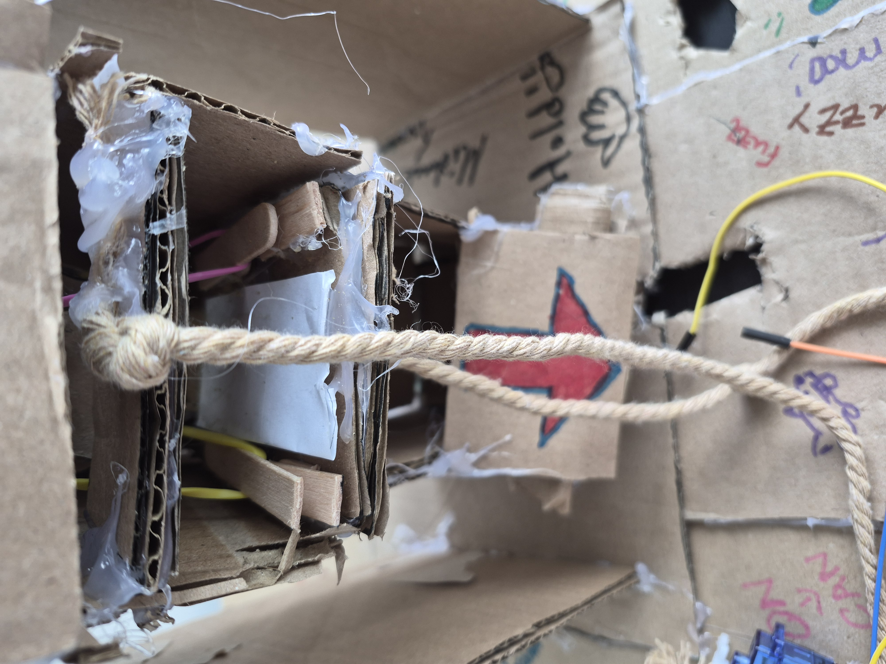
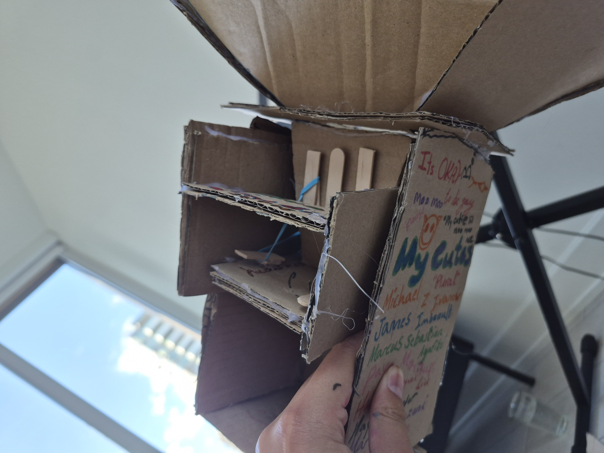
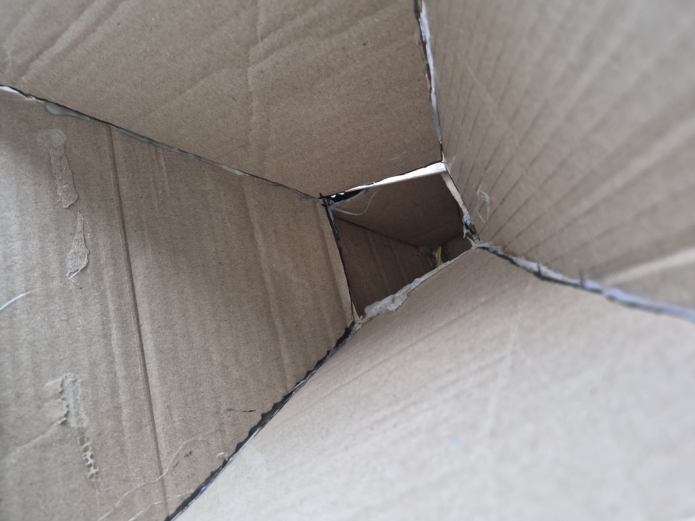
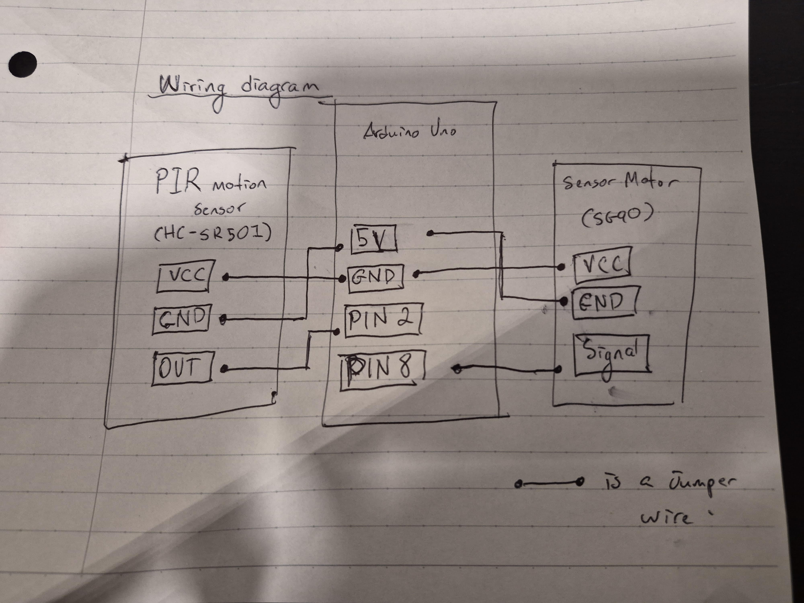

## Hazel food dispenser
This is a medium sized project for my dog, her name is Hazel.

# The dog food dispenser for Hazel.

A motion type activated dog food dispenser that was indeed built with an Arduino Uno and a servo controlled gate.
# How it works

An Arduino UNO is powered up by code on the Arduino IDE. The Arduino uno powers up a servo which horn rotates the dispenser to poor out dog food kebble. The servo must be held in one hand in order to rotate the dispenser.

# Bill of materials
| Part | Identifier | Price | Link to product|
|---|---|---|---|
| My arduino uno | Arduino Uno R3 (A000066) | $40.99 | [Amazon.ca(https://www.amazon.ca/ARDUINO-A000066-Uno-DIP-1-5/dp/B008GRTSV6)]
| Servo motor used in the project |ACEIRMC SG90 9G Mirco servo (5-pack) |$14.99 | [Amazon.ca(https://www.amazon.ca/ACEIRMC-Helicopter-Airplane-Remote-Control/dp/B0BMFY8SX8)]           
|Rope (thicker rope) |Leecogo 6mm jute rope, 66ft | $12.99 | [Amazon.ca(https://www.amazon.ca/Gardening-Scratching-Replacement-Repairing-Recovering/dp/B088DY9WMR)]           
|My popsicle sticks for the dispenser mechanism |  4.5" wooden popsicle sticks (200 pack, 4 colours)|$9.99 | [Amazon.ca(https://www.amazon.ca/Natural-Wooden-Popsicle-Sticks-Smooth/dp/B093YY3GR7)]
|my elastic bands |Colourful rubber bands (200 pack, 4 colours) | $9.45| [Amazon.ca(https://www.amazon.ca/Elastic-Colorful-Rubber-Office-Supplies/dp/B0BTKXYQ64)]
|Hot glue that I used for every part of the project. |Amazon basics hot glue gun kit (30 sticks) |$12.93 | [Amazon.ca(https://www.amazon.ca/Amazon-Basics-Hot-Glue-Sticks/dp/B0DMSH894V)]
|Jumper wires | Jumper wires, male-to-male (65 pack) | $10.03 | [Amazon.ca(https://www.amazon.ca/Solderless-Flexible-Breadboard-Jumper-Arduino/dp/B093LBMWTZ)]
|Cable used |Amazon basic USB 2.0 A-Male to B-male cable, 16ft |$12.14 | [Amazon.ca(https://www.amazon.ca/AmazonBasics-USB-2-0-Cable-Male/dp/B00BCWALHM)]
|Cardboard from Ikea products |Reused shipping boxes from Ikea |Free | 
|Dog food for Hazel| Purina ONE +Plus small breed with beef, 3.63kg |22.97 |[Amazon.ca(https://www.amazon.ca/Purina-ONE-Small-Breed-3-63kg/dp/B079NMT8YY)]
|Total price | $148.48CAD|

 No Board files or schematic  PDF is found because a good majority of the project is made from straight cardboard material. There are as well the Arduino Uno, the servo motors, and a little more.
 
 
 
 
 

My demo video for the project

<<<<<<< HEAD
# Assemble instructions

1> **Building the body**
Assemble a cardboard box to form the central body of the dispenser (8 by 8 by 10cm typically)

2> **Build the funnel**
Cut out and fold cardboard into a funnel shape wide at the top. (8 by 8 cm) then attach to the inside of the cardboard box.

3> **Cut the dispensing opening**
Cut an opening at the bottom of the funnel however wide you would like but still smaller than the top of the funnel. I suggest 4 by 4 cm.

4> **Build the level/gate mechanism**
Construct a lever or flap that blocks the opening when at rest. This step is optional, I made mine out of cardboard.

5> **Mount the servo**
Attach the servo to the body, positioned so its horn can easily pull the string down as seen in the demo video.This is the main mechanism of the dispenser

6> **Attach the string to the servo horn**
Tie or glue the string to the servo horn so when the servo rotates, the mechanism of the dispenser (funnel) moves downward.

7> **Wire the electronics**
Instructions and wiring diagram will be found in the repo.
-Servo signal twice
-Servo power ground

8> **Test and callibrate**
Test the project

9> **Decorate**
Add any artwork or designs of your desires (makes sure they are appropriate).

# Wiring diagram

 
